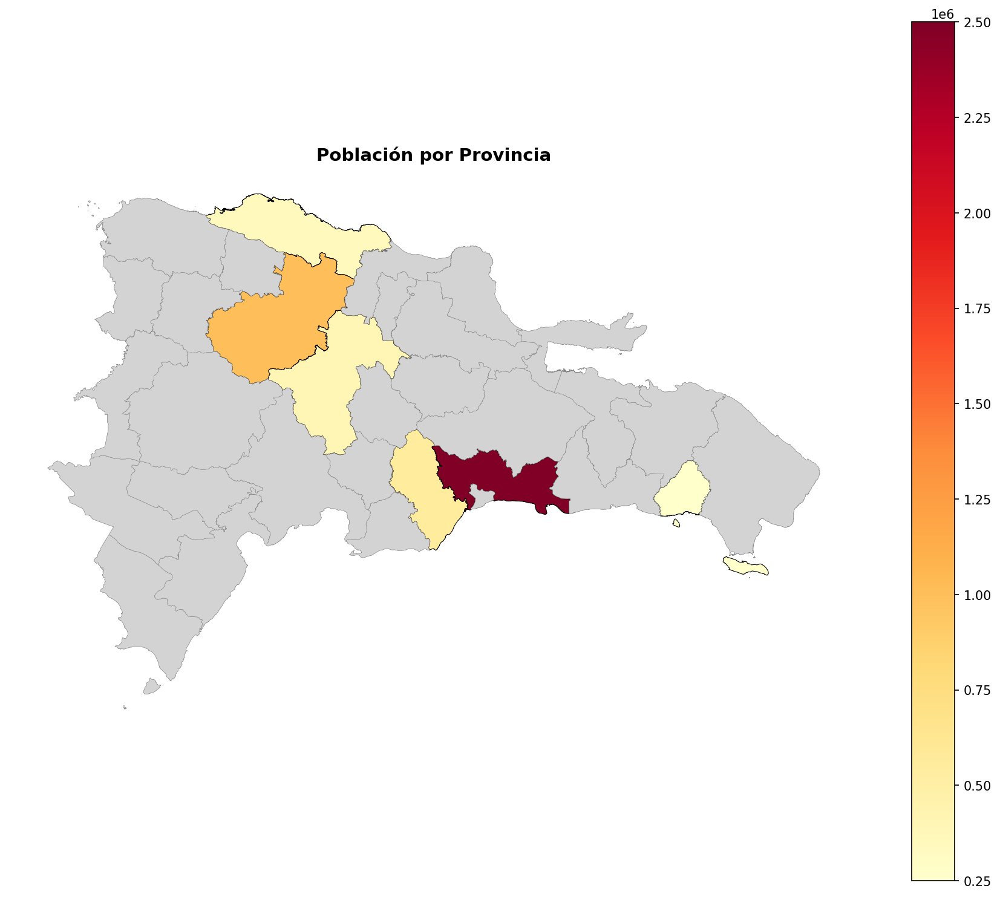
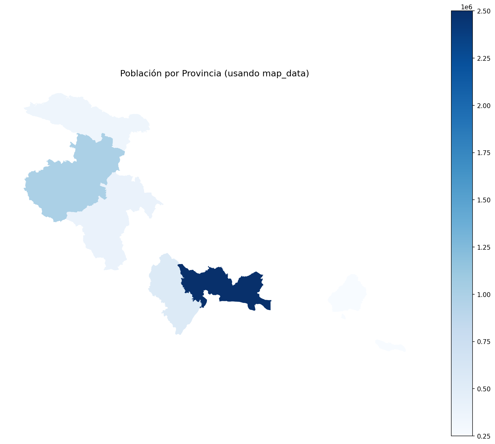
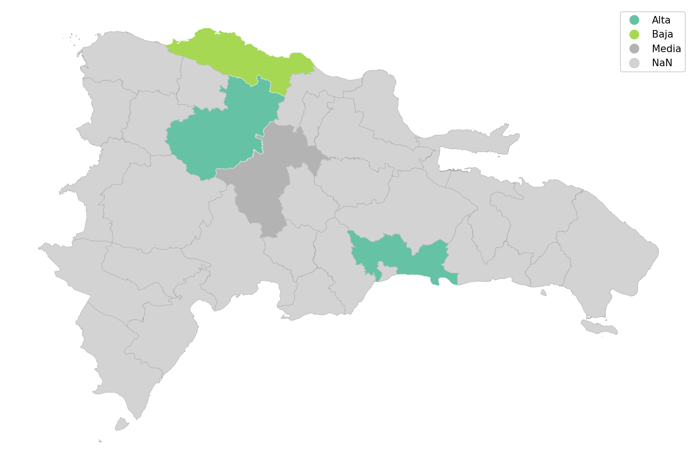

# Mapeo

geodompy facilita la creación de mapas coropléticos de la República Dominicana.

## Mapa rápido con map()

```python
import pandas as pd
import geodompy as gd

datos = pd.DataFrame({
    'provincia': ['Santo Domingo', 'Santiago', 'La Vega', 'Puerto Plata'],
    'poblacion': [2500000, 1000000, 400000, 350000]
})

# Crear mapa automático
gd.map(datos)
```


La función `map()`:
1. Detecta automáticamente el nivel geográfico
2. Detecta la variable para fill
3. Une tus datos con las geometrías
4. Crea el mapa

## Personalización

```python
gd.map(
    datos,
    fill='poblacion',          # Variable para colorear
    cmap='YlOrRd',             # Paleta de colores
    title='Población por Provincia',
    figsize=(12, 10),          # Tamaño
    edgecolor='black',         # Color de bordes
    linewidth=0.5,             # Grosor de bordes
    legend=True                # Mostrar leyenda
)
```



### Parámetros principales

| Parámetro | Tipo | Default | Descripción |
|-----------|------|---------|-------------|
| `data` | DataFrame | - | Datos a mapear |
| `fill` | str | None | Variable para fill (auto-detectada) |
| `level` | str | None | Nivel geográfico (auto-detectado) |
| `name` | str | None | Columna geográfica en data |
| `cmap` | str | "viridis" | Paleta de colores matplotlib |
| `figsize` | tuple | (10, 8) | Tamaño de figura |
| `title` | str | None | Título del mapa |
| `legend` | bool | True | Mostrar leyenda |
| `edgecolor` | str | "white" | Color de bordes |
| `linewidth` | float | 0.3 | Grosor de bordes |

## map_data()

Si necesitas más control, usa `map_data()` para obtener el GeoDataFrame:

```python
# Preparar datos sin mostrar mapa
map_df = gd.map_data(datos, fill='poblacion')

# Ahora tienes un GeoDataFrame con tus datos + geometrías
print(type(map_df))  # geopandas.GeoDataFrame

# Personalizar con matplotlib
import matplotlib.pyplot as plt

fig, ax = plt.subplots(1, 1, figsize=(12, 10))
map_df.plot(
    column='poblacion',
    ax=ax,
    cmap='Blues',
    legend=True
)
ax.set_title('Población por Provincia')
ax.axis('off')
plt.tight_layout()
plt.show()
```



## Paletas de colores

geodompy usa paletas de matplotlib. Algunas opciones populares:

### Secuenciales (para datos numéricos)
- `viridis` (default) - Perceptualmente uniforme
- `YlOrRd` - Amarillo a rojo
- `Blues` - Azules
- `Greens` - Verdes
- `Purples` - Morados

### Divergentes (para datos con punto medio)
- `RdYlGn` - Rojo-Amarillo-Verde
- `coolwarm` - Frío a cálido
- `RdBu` - Rojo a azul

### Categóricas
- `tab10` - 10 colores distintos
- `Set2` - Colores pastel

```python
# Ejemplo con paleta secuencial
gd.map(datos, cmap='YlOrRd')

# Invertir paleta
gd.map(datos, cmap='YlOrRd_r')
```

## Mapeo por niveles

```python
# Provincias
datos_prov = pd.DataFrame({
    'provincia': ['Santo Domingo', 'Santiago'],
    'valor': [100, 200]
})
gd.map(datos_prov)

# Regiones
datos_reg = pd.DataFrame({
    'region': ['Ozama', 'Cibao Norte'],
    'valor': [100, 200]
})
gd.map(datos_reg)

# Municipios
datos_mun = pd.DataFrame({
    'municipio': ['Santo Domingo Este', 'Santiago'],
    'valor': [100, 200]
})
gd.map(datos_mun)
```

## Datos categóricos

```python
datos = pd.DataFrame({
    'provincia': ['Santo Domingo', 'Santiago', 'La Vega'],
    'categoria': ['Alta', 'Media', 'Baja']
})

gd.map(datos, fill='categoria', cmap='Set2')
```



## Combinar con otros gráficos

```python
import matplotlib.pyplot as plt

fig, axes = plt.subplots(1, 2, figsize=(16, 6))

# Mapa
gd.map(datos, ax=axes[0], title='Distribución Geográfica')

# Gráfico de barras
datos.plot.bar(x='provincia', y='poblacion', ax=axes[1])
axes[1].set_title('Población')

plt.tight_layout()
plt.show()
```

## Guardar mapa

```python
import matplotlib.pyplot as plt

# Crear mapa
gd.map(datos, title='Mi Mapa')

# Guardar
plt.savefig('mapa.png', dpi=300, bbox_inches='tight')
plt.savefig('mapa.pdf', bbox_inches='tight')  # Para publicaciones
```

## Manejo de datos faltantes

Si algunas regiones no tienen datos:

```python
# Solo algunas provincias
datos = pd.DataFrame({
    'provincia': ['Santo Domingo', 'Santiago'],
    'valor': [100, 200]
})

# Las provincias sin datos aparecen en gris por defecto
gd.map(datos)
```

Para personalizar:

```python
map_df = gd.map_data(datos)

# Rellenar NaN con valor
map_df['valor'] = map_df['valor'].fillna(0)

# Mapear
map_df.plot(column='valor', cmap='viridis')
```
