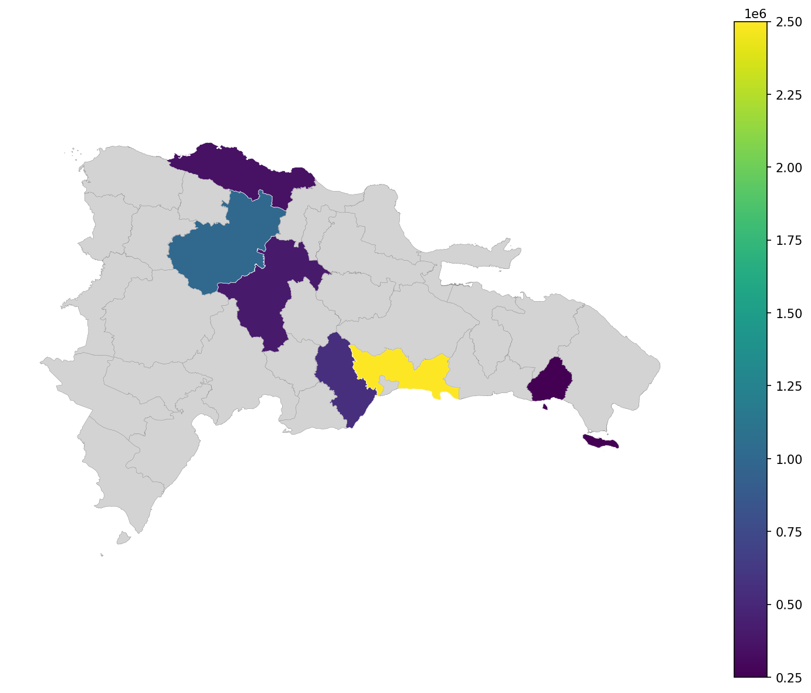

# geodompy

**Acceso a un Marco de Datos Geoespaciales Estandarizados para la República Dominicana**

[](https://badge.fury.io/py/geodompy)
[](https://www.python.org/downloads/)
[](https://opensource.org/licenses/MIT)

---

## ¿Qué es geodompy?

**geodompy** es un paquete Python que provee un conjunto de funciones para descargar y cargar de forma eficiente datos geoespaciales estandarizados de la República Dominicana.

Este paquete es un componente central de **GeoDOM**, una iniciativa de [Adatar](https://adatar.do), que busca ofrecer un framework unificado para el análisis geoespacial.

## Características Principales

<div class="grid cards" markdown>

-   :material-map:{ .lg .middle } **Datos Geoespaciales**

    ---

    Acceso a límites administrativos: provincias, regiones, municipios, distritos municipales, secciones, barrios y parajes.

-   :material-cached:{ .lg .middle } **Sistema de Caché**

    ---

    Caché local inteligente usando `pins` para minimizar descargas y permitir trabajo offline.

-   :material-auto-fix:{ .lg .middle } **Detección Automática**

    ---

    Detecta automáticamente niveles geográficos y variables de fill para mapas.

-   :material-brush:{ .lg .middle } **Limpieza de Nombres**

    ---

    Estandariza nombres geográficos con fuzzy matching y datasets de alias.

-   :material-language-r:{ .lg .middle } **Interoperabilidad con R**

    ---

    Compatible con `geodomR`: comparte caché y estructura de datos.

-   :material-palette:{ .lg .middle } **Mapeo Fácil**

    ---

    Crea mapas coropléticos con una sola línea de código.

</div>

## Instalación Rápida

```bash
pip install geodompy
```

## Ejemplo Básico

```python
import geodompy as gd
import pandas as pd

# Obtener geometrías de provincias
provincias = gd.provinces()

# Crear datos de ejemplo
datos = pd.DataFrame({
    'provincia': ['Santo Domingo', 'Santiago', 'La Vega', 'Puerto Plata'],
    'poblacion': [2500000, 1000000, 400000, 350000]
})

# Crear mapa automático (detecta nivel y variable)
gd.map(datos)
```

{ loading=lazy }

## Niveles Administrativos Disponibles

| Nivel | Función | Descripción |
|-------|---------|-------------|
| Provincias | `gd.provinces()` | 32 provincias + Distrito Nacional |
| Regiones | `gd.regions()` | Regiones Únicas de Planificación (Ley 345-22) |
| Municipios | `gd.municipalities()` | 158 municipios |
| Distritos Municipales | `gd.dm()` | Distritos municipales |
| Secciones | `gd.sections()` | Secciones censales |
| Zonas | `gd.zones()` | Urbana / Rural |
| Barrios/Parajes | `gd.bparajes()` | Barrios y parajes |
| Macro-regiones | `gd.macroregions()` | 3 macro-regiones |

## Estructura del Proyecto

```
geodompy/
├── data.py       # Funciones de datos (provinces, regions, etc.)
├── clean.py      # Limpieza de nombres geográficos
├── detect.py     # Detección automática de niveles
├── map.py        # Funciones de mapeo
└── cache.py      # Sistema de caché con pins
```

## Enlaces Útiles

- [Repositorio en GitHub](https://github.com/drdsdaniel/geodompy)
- [geodomR (versión para R)](https://drdsdaniel.github.io/geodomR/)
- [GeoDOM Worker API](https://geodom-worker.drdsdaniel.workers.dev/)
- [Adatar](https://adatar.do)

## Version 0.2.0

Esta version agrega paridad funcional ampliada con `geodomR`: aliases `gd_*`,
limpieza para distritos municipales, secciones y barrios/parajes,
`add_parent_cols()` y helpers de mapeo Matplotlib.
